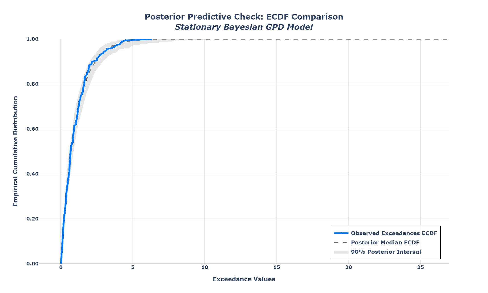

# Ground Insight

A Python toolkit for groundwater level analysis, rainfall relationships, and interactive visualisation.

## Overview

Ground Insight provides a modular framework for:

- **Data loading** — indexed, long, and wide CSV formats; single file, multi-file folder, and large multi-file datasets
- **Trend analysis** — Mann-Kendall (original and seasonal), hydrological year statistics, time evolution
- **Statistical hypothesis testing** — independent t-tests comparing wells and time periods (p-values, effect size, significance)
- **Monthly statistics** — seasonal boxplot summaries of groundwater levels by month and year, with customisable percentiles
- **Extreme value analysis** — Block Maxima (GEV) and Peaks Over Threshold (GPD); stationary and non-stationary models; seasonal and drought/flood modes; a complete Bayesian MCMC workflow (priors → `emcee` sampling → convergence diagnostics → posterior predictive checks → credible intervals on return levels)
- **Wavelet analysis** — CWT, DWT, and SWT; wavelet coherence, cross-wavelet and partial coherence; phase analysis; optional confounder adjustment (rainfall, pumping, tide); groundwater–rainfall comparison *(ongoing development)*
- **Interactive dashboards** — Dash and Plotly visualisations

## Requirements

- Python 3.8+ (tested with 3.10)
- Dependencies listed in `requirements.txt`

**No manual setup needed:** the first cell of `Gwldd.ipynb` calls `install_requirements()`, which installs everything from `requirements.txt` into the active kernel automatically. Just open the notebook and run the first cell.

To install manually instead (optional):

```bash
pip install -r requirements.txt
```

Or from Python:

```python
from src.install_packages import install_requirements
install_requirements()
```

## Quick start

### 1. Open the notebook

Start Jupyter in this folder and open `Gwldd.ipynb`:

```bash
cd /path/to/Ground_Insight
jupyter notebook Gwldd.ipynb
```

### 2. Set your paths

In the **PATHS AND SETTINGS** cell in `Gwldd.ipynb`, set `PROJECT_ROOT` to wherever you cloned the repo (or wherever your CSVs live). If you start Jupyter from the project folder, `Path.cwd()` is enough.

**Data are not on GitHub.** After cloning, copy your CSVs into the project (see [`DATA.md`](DATA.md)), then point the filenames below at those files.

```python
from pathlib import Path

PROJECT_ROOT = Path.cwd()  # or Path(r"/path/to/Ground_Insight")

module_path = str(PROJECT_ROOT)
data_folder = str(PROJECT_ROOT)

groundwater_filename = "DunTestData.csv"   # your groundwater CSV name
rainfall_filename = "DunRain.csv"          # optional; set to "None" if unused
mapping_filename = "None"

# Optional modes
use_folder_mode = False
csv_folder_path = str(PROJECT_ROOT / "folder_mode_data")
use_large_dataset_mode = False
large_dataset_path = str(PROJECT_ROOT / "large_dataset")
```

Data folders (`large_dataset`, `folder_mode_data`) are examples and stay **local only**. Their layouts differ: `large_dataset` holds large long-format CSVs (any filenames); `folder_mode_data` holds many per-site CSVs. See **[`DATA.md`](DATA.md)** for structure, column names, and loading modes.

### 3. Run the analysis

Run the notebook cells in order. The main entry point loads data and prompts you to choose a visualisation:

```python
from src.main import main_unified

data, well_columns, mapping_dict, quality_dfs = main_unified(
    use_folder_mode=use_folder_mode,
    csv_folder_path=csv_folder_path,
    rainfall_filename=rainfall_filename,
    mapping_filename=mapping_filename,
    use_large_dataset_mode=use_large_dataset_mode,
    large_dataset_path=large_dataset_path,
    groundwater_filename=groundwater_filename,
    data_folder=data_folder,
    CONVERT_MM_TO_METERS=False,
    REMOVE_DUPLICATES=False,
)
```

Once the data have loaded, choose from the interactive menu (static plots, Julian plot, EVA, wavelets, batch Mann-Kendall, and more).

## Project layout

```
Ground_Insight/
├── src/
│   ├── data_loading/              # Loaders, format detection, unit conversion
│   ├── plotting/
│   │   ├── mann_kendall/          # Trend analysis and batch exports
│   │   ├── extreme_value_analysis/    # Block Maxima (GEV)
│   │   ├── extreme_value_analysis_pot/  # Peaks Over Threshold (GPD)
│   │   ├── wavelet_analysis/      # Wavelet dashboards
│   │   ├── statistics/            # Monthly statistics
│   │   ├── statistical_tests/
│   │   ├── julian_plot/
│   │   ├── overlay/
│   │   ├── static_plots/
│   │   ├── subplot/
│   │   └── Batch_Mann_Kendall.py
│   ├── main.py                    # main_unified() and visualisation menu
│   └── install_packages.py
├── large_dataset/                 # Local only (not in repo); large long-format CSVs
├── folder_mode_data/              # Local only; many per-site CSVs
├── Gwldd.ipynb                    # Main workflow notebook
├── requirements.txt
└── README.md
```

## Data loading modes

| Mode | When to use | Key inputs |
|------|-------------|------------|
| **Single file** | One groundwater CSV (+ optional rainfall) | `groundwater_filename`, `data_folder` |
| **Folder** | Many well CSVs in one directory | `use_folder_mode=True`, `csv_folder_path` |
| **Large dataset** | Multi-file long-format layout (any CSV names) | `use_large_dataset_mode=True`, `large_dataset_path` |

Groundwater CSVs should include a `DateTime` column. Rainfall files use `DateTime` and `mm_Rain`.

## Analysis modules

### Mann-Kendall (`src/plotting/mann_kendall/`)

Batch trend analysis, seasonal MK, hydrological year statistics, and exports. User settings are in `src/plotting/mann_kendall/config.txt`:

```
USE_ROLLING_MEAN = True
ROLLING_WINDOW_SIZE = 7
ALPHA_LEVEL = 0.05
RESAMPLE_FREQUENCY = D
```

### Statistical hypothesis testing (`src/plotting/statistical_tests/`)

Interactive comparison of groundwater levels across wells and time periods using independent t-tests, with p-values, t-statistics, Cohen's d effect size, and significance at α = 0.05.

```python
from src.plotting.statistical_tests import run_statistical_analysis

run_statistical_analysis(data, well_columns)
```

### Extreme value analysis

```python
from src.plotting.extreme_value_analysis import run_eva_analysis       # Block Maxima (GEV)
from src.plotting.extreme_value_analysis_pot import run_pot_dashboard  # Peaks Over Threshold (GPD)
```

Both GEV and GPD models can be fitted by maximum likelihood **or** through a complete Bayesian MCMC workflow, so uncertainty is propagated end-to-end rather than reported as a single point estimate:

1. **Priors + likelihood** — weakly-informative priors on the shape/scale (and a linear trend on scale for non-stationary models), combined with the GEV/GPD log-likelihood.
2. **Sampling** — affine-invariant ensemble MCMC with [`emcee`](https://emcee.readthedocs.io) (32 walkers; 15,000–20,000 steps; burn-in discarded; chains thinned).
3. **Convergence diagnostics** — mean acceptance fraction (target 0.2–0.5) and integrated autocorrelation time, with effective sample sizes reported.
4. **Posterior predictive checks** — replicate datasets simulated from posterior draws; the posterior-predictive ECDF envelope (90% interval) is overlaid on the observed ECDF, and observed summary statistics (mean, variance, 95th percentile, min, max) are compared against their posterior-predictive credible intervals.
5. **Inference outputs** — posterior medians, corner plots of the joint posterior, and return levels with 95% credible intervals (time-varying for non-stationary models).

See `extreme_value_analysis*/bayesian_analysis.py` (sampling + diagnostics) and `extreme_value_analysis*/plotting/ppc_plots.py` (posterior predictive checks).



*Posterior predictive check (stationary Bayesian GPD). The observed exceedance ECDF falls within the 90% posterior-predictive interval, indicating the fitted model reproduces the data. Regenerate with `python docs/generate_ppc_example.py`.*

### Wavelet analysis (`src/plotting/wavelet_analysis/`)

Interactive dashboard for time–frequency analysis of groundwater and rainfall. Supports continuous (CWT), discrete (DWT), and stationary (SWT) transforms; wavelet coherence, cross-wavelet transform (XWT), and partial wavelet coherence (PWC); phase analysis; and optional removal of confounder effects (rainfall, pumping, tide) before analysis.

> **Note:** Wavelet analysis is under active development. Core functionality is available, but further modularisation, testing, and documentation are in progress.

```python
from src.plotting.wavelet_analysis import run_wavelet_analysis

run_wavelet_analysis(
    data=data,
    well_columns=well_columns,
    rainfall_col="mm_Rain",
    remove_rainfall=False,
    confounder_lags=7,
)
```

### Batch Mann-Kendall

```python
from src.plotting.Batch_Mann_Kendall import (
    run_yearly_water_level_statistics,
    run_hydrological_year_analysis_both_types,
    run_comprehensive_original_mk_batch_analysis_separate_files,
    run_comprehensive_seasonal_mk_batch_analysis_separate_files,
)
```

## Visualisation menu

When you run `main_unified()`, you can select:

1. Static interactive plot  
2. Julian plot  
3. Subplots  
4. Overlay  
5. Monthly statistics  
6. Statistical hypothesis testing  
7. Extreme value analysis (Block Maxima)  
8. Extreme value analysis (POT)  
9. Wavelet analysis  
10. Batch Mann-Kendall  
11. All  
12. Exit  

## Data on GitHub

CSV and data folders are excluded from the repository. Clone the repo, then add your own data locally before running the notebook. Folder layouts, column names, and examples for `large_dataset` and `folder_mode_data` are documented in **[`DATA.md`](DATA.md)**.

## Publishing to GitHub

From this folder:

```bash
git init
git add .
git commit -m "Initial commit: Ground Insight groundwater analysis toolkit"
```

Repository: **https://github.com/Paul-Oluwunmi/Ground-Insight**

```bash
git branch -M main
git remote add origin https://github.com/Paul-Oluwunmi/Ground-Insight.git
git push -u origin main
```

## How to cite

If you use Ground Insight in a report, thesis, or publication, please cite the repository (prefer a [release version](https://github.com/Paul-Oluwunmi/Ground-Insight/releases) when available):

> Oluwunmi, P. (2026). Ground Insight (Version 0.1.0) [Computer software]. https://github.com/Paul-Oluwunmi/Ground-Insight

Citation metadata is also in [`CITATION.cff`](CITATION.cff) (GitHub’s “Cite this repository”).

## Contact

Questions and feedback: open a [GitHub Issue](https://github.com/Paul-Oluwunmi/Ground-Insight/issues).

## Acknowledgements

Built with Dash, Plotly, PyWavelets, emcee, pandas, polars, SciPy, statsmodels, and pymannkendall.
